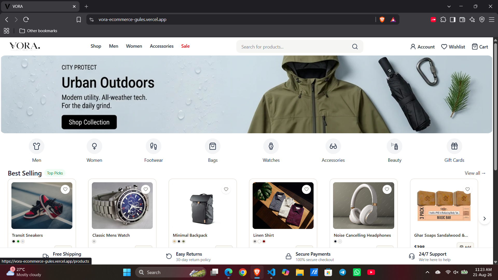
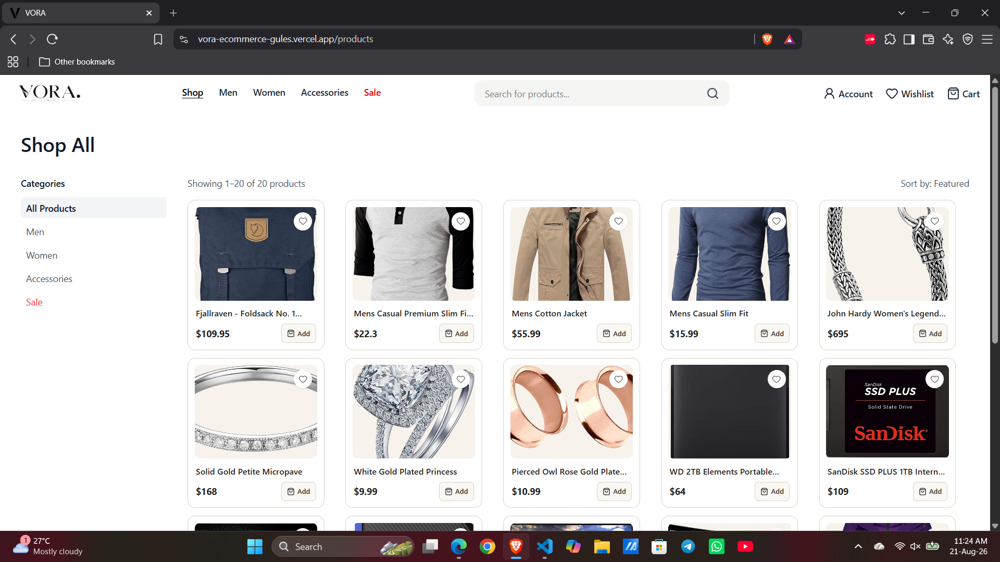
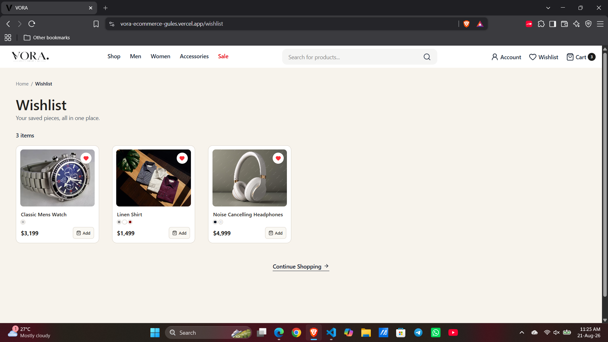
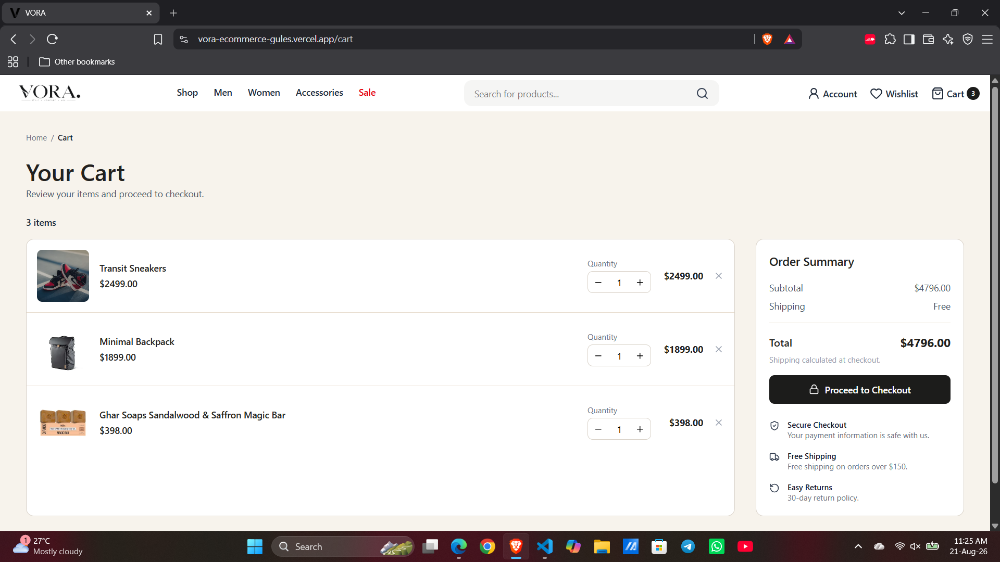

# VORA. 🖤

A modern, minimalist e-commerce storefront built as a hands-on React learning project. VORA combines a clean, premium UI with real-world frontend architecture — routing, global state via Context API, API integration, and persistent client-side storage.

**Live Demo:** _( https://vora-ecommerce-gules.vercel.app/ )_

---

## ✨ Features

- **Product Browsing** — Live product data via FakeStoreAPI, with category filtering (Men, Women, Accessories) and text search
- **Wishlist** — Save/remove products with a heart toggle, synced across every page, persisted via localStorage
- **Cart** — Add to cart, adjust quantities, remove items, live cart count badge in the navbar, order summary with shipping calculation
- **Account** — UI-only login/logout flow (Context + localStorage, no backend)
- **Responsive Product Grid** — Compact, premium product cards with color swatches and quick-add buttons
- **Toast Notifications** — Instant feedback on cart actions via `react-hot-toast`
- **Client-side Routing** — Full multi-page navigation with React Router DOM, including active-link highlighting and query-param-based filtering

---

## 🛠️ Tech Stack

- **React** — Component-based UI
- **React Router DOM** — Client-side routing
- **Context API** — Global state (Wishlist, Cart, Auth)
- **Tailwind CSS v4** — Utility-first styling
- **Axios** — API requests
- **Lucide React** — Icon set
- **FakeStoreAPI** — Product data source
- **react-hot-toast** — Toast notifications
- **Vite** — Build tool & dev server

---

## 📁 Project Structure
src/
├── assets/ # Images, logos
├── components/ # Reusable UI components (Navbar, ProductCard, etc.)
├── context/ # Global state providers (Wishlist, Cart, Auth)
├── pages/ # Route-level pages (Home, Products, Cart, Wishlist, Login)
├── App.jsx
└── main.jsx


---

## 🚀 Getting Started

**1. Clone the repository**
```bash
git clone https://github.com/ArslanNagori/vora-ecommerce.git
cd vora-ecommerce
```

**2. Install dependencies**
```bash
npm install
```

**3. Run the dev server**
```bash
npm run dev
```

The app will be available at `http://localhost:5173`.

---

## 🗺️ Roadmap

- [ ] Mobile responsive 
- [ ] Sort functionality on Products page
- [ ] Product Details page
- [ ] Price range filter
- [ ] Backend integration (Node.js + Express + MongoDB) for real authentication, persistent cart/wishlist, and order management

---

## 📸 Screenshots

- Home 


- Products
 

- Wishlist 


- Cart 



## 🧑‍💻 Author

**Arslan Nagori**
[LinkedIn](https://linkedin.com/in/arslannagori)